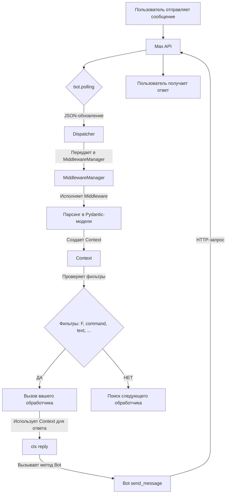

# Руководство по API AsyncMaxBot SDK

Этот раздел — ваш главный справочник по всем компонентам, классам и типам данных AsyncMaxBot SDK версии 1.4.2, основанный на актуальном коде.

> ℹ️ **Примечание:** Эта библиотека является высокоуровневой оберткой. Для более глубокого понимания принципов работы, доступных методов и типов объектов, мы настоятельно рекомендуем ознакомиться с [официальной документацией Max API](https://dev.max.ru/docs-api).

---

## 1. Архитектура и поток данных



**Поток обработки:**
1. `bot.polling(dispatcher=dp)` постоянно запрашивает у Max API новые обновления
2. `Dispatcher` получает обновление и передает его в `MiddlewareManager`
3. Middleware обрабатывают входящий запрос по цепочке
4. Данные парсятся в строго типизированные Pydantic-модели
5. На основе этих моделей создается удобный объект `Context`
6. `Dispatcher` ищет подходящий обработчик, проверяя сообщение на соответствие его `фильтрам`
7. Если фильтры пройдены, вызывается ваша асинхронная функция-обработчик с `Context` в качестве аргумента

---

## 2. Класс `Bot`

Основной класс для взаимодействия с Max API. Рекомендуется использовать как асинхронный контекстный менеджер.

### Инициализация и запуск

```python
from maxbot import Bot, Dispatcher

async with Bot(token=TOKEN) as bot:
    dp = Dispatcher(bot)
    # ... регистрация обработчиков ...
    await bot.polling(dispatcher=dp)
```

### Основные методы

#### Информация о боте
- `get_me()` -> `Dict[str, Any]`: Возвращает информацию о боте в виде словаря

#### Отправка сообщений
- `send_message(text: str, user_id: Optional[int] = None, chat_id: Optional[int] = None, reply_markup: Optional[Any] = None, **kwargs)` -> `Dict[str, Any]`: Отправляет текстовое сообщение
  - **Обязательно**: либо `user_id`, либо `chat_id`
  - `reply_markup`: Поддержка inline клавиатур
- `edit_message(message_id: str, text: str, reply_markup: Optional[Any] = None, **kwargs)` -> `Dict[str, Any]`: Редактирует сообщение
- `delete_message(message_id: str)` -> `Dict[str, Any]`: Удаляет сообщение

#### Работа с файлами
- `upload_image(file: Union[str, BinaryIO, bytes], **kwargs)` -> `Dict[str, Any]`: Загружает изображение
- `upload_video(file: Union[str, BinaryIO, bytes], **kwargs)` -> `Dict[str, Any]`: Загружает видео
- `upload_audio(file: Union[str, BinaryIO, bytes], **kwargs)` -> `Dict[str, Any]`: Загружает аудио
- `upload_file(file: Union[str, BinaryIO, bytes], **kwargs)` -> `Dict[str, Any]`: Загружает файл
- `upload_sticker(file: Union[str, BinaryIO, bytes], **kwargs)` -> `Dict[str, Any]`: Загружает стикер
- `download_file(file_id: str, save_path: Optional[str] = None)` -> `Union[bytes, str]`: Скачивает файл
- `get_file(file_id: str)` -> `Dict[str, Any]`: Получает информацию о файле

#### Отправка вложений
- `send_photo(photo: Union[str, BinaryIO, bytes, Dict], user_id: Optional[int] = None, chat_id: Optional[int] = None, caption: Optional[str] = None, **kwargs)` -> `Dict[str, Any]`: Отправляет фото
- `send_video(video: Union[str, BinaryIO, bytes, Dict], user_id: Optional[int] = None, chat_id: Optional[int] = None, caption: Optional[str] = None, **kwargs)` -> `Dict[str, Any]`: Отправляет видео
- `send_audio(audio: Union[str, BinaryIO, bytes, Dict], user_id: Optional[int] = None, chat_id: Optional[int] = None, caption: Optional[str] = None, **kwargs)` -> `Dict[str, Any]`: Отправляет аудио
- `send_document(document: Union[str, BinaryIO, bytes, Dict], user_id: Optional[int] = None, chat_id: Optional[int] = None, caption: Optional[str] = None, **kwargs)` -> `Dict[str, Any]`: Отправляет документ

#### Работа с чатами
- `get_chat(chat_id: int)` -> `Dict[str, Any]`: Получает информацию о чате
- `get_chats(**kwargs)` -> `Dict[str, Any]`: Получает список чатов
- `get_chat_members(chat_id: int, **kwargs)` -> `Dict[str, Any]`: Получает участников чата
- `add_chat_members(chat_id: int, user_ids: List[int])` -> `Dict[str, Any]`: Добавляет участников в чат
- `leave_chat(chat_id: int)` -> `Dict[str, Any]`: Покидает чат

#### Действия в чате
- `send_action(chat_id: int, action: str)` -> `Dict[str, Any]`: Отправляет действие (например, 'typing')
- `pin_message(chat_id: int, message_id: str, **kwargs)` -> `Dict[str, Any]`: Закрепляет сообщение
- `unpin_message(chat_id: int, message_id: str)` -> `Dict[str, Any]`: Открепляет сообщение

#### Callback обработка
- `answer_callback_query(callback_id: str, **kwargs)` -> `Dict[str, Any]`: Отвечает на callback-запрос
- `send_callback(callback_query_id: str, **kwargs)` -> `Dict[str, Any]`: Алиас для answer_callback_query

#### Валидация файлов
- `validate_file_size(file: Union[str, BinaryIO, bytes], max_size_mb: int = 50)` -> `bool`: Проверяет размер файла
- `validate_file_format(file: Union[str, BinaryIO, bytes], file_type: str)` -> `bool`: Проверяет формат файла
- `get_supported_formats(file_type: str)` -> `List[str]`: Получает поддерживаемые форматы

#### Получение обновлений
- `get_updates(offset: Optional[int] = None, limit: int = 100, timeout: int = 20)` -> `Dict`: Получает обновления от API
- `polling(timeout: int = 1, long_polling_timeout: int = 20, dispatcher: 'Dispatcher' = None)`: Основной метод для запуска бота

---

## 3. Класс `Dispatcher`

Диспетчер обрабатывает обновления, управляет middleware и вызывает нужные обработчики.

### Инициализация
```python
from maxbot import Dispatcher

dp = Dispatcher(bot)
```

### Регистрация обработчиков

#### Обработчики сообщений
- `@dp.message_handler(*filters)`: Декоратор для регистрации обработчика сообщений

#### Обработчики callback-запросов
- `@dp.callback_query_handler(*filters)`: Декоратор для регистрации обработчика callback-запросов

#### Обработчики событий (версия 1.4+)
- `@dp.bot_started_handler(*filters)`: Обработчик события запуска бота
- `@dp.user_added_handler(*filters)`: Обработчик добавления пользователя в чат
- `@dp.chat_member_updated_handler(*filters)`: Обработчик изменения статуса участника

### Middleware
- `dp.include_middleware(middleware)`: Добавляет middleware в цепочку обработки
- `dp.include_router(router)`: Подключает роутер к диспетчеру

---

## 4. Класс `Context`

Ключевой объект, с которым вы работаете в обработчиках. Содержит все данные об обновлении и удобные методы для ответа.

### Основные атрибуты

#### Информация о пользователе и чате
- `user: Optional[User]`: Объект пользователя
- `chat: Optional[Chat]`: Объект чата
- `user_id: Optional[int]`: ID пользователя
- `chat_id: Optional[int]`: ID чата

#### Информация о сообщении
- `message: Optional[Message]`: Объект сообщения
- `text: Optional[str]`: Текст сообщения
- `message_id: Optional[str]`: ID сообщения
- `date: int`: Временная метка сообщения

#### Вложения
- `attachments: Optional[List[BaseAttachment]]`: Список вложений
- `has_attachments: bool`: True, если есть вложения
- `images: List[BaseAttachment]`: Список изображений

#### Callback информация
- `is_callback: bool`: True, если это callback-запрос
- `payload: Optional[str]`: Payload callback-запроса
- `callback_id: Optional[str]`: ID callback-запроса

#### Расширенные события (версия 1.4+)
- `bot_started: Optional[BotStarted]`: Данные события запуска бота
- `user_added: Optional[UserAdded]`: Данные добавления пользователя
- `chat_member_updated: Optional[ChatMemberUpdated]`: Данные изменения статуса участника

### Основные методы

#### Отправка сообщений
- `reply(text: str, reply_markup: Optional[Any] = None, **kwargs)` -> `Dict[str, Any]`: Ответить в тот же чат
- `answer(text: str, reply_markup: Optional[Any] = None, **kwargs)` -> `Dict[str, Any]`: Псевдоним для reply

#### Редактирование и удаление
- `edit_message(text: str, reply_markup: Optional[Any] = None, **kwargs)` -> `Dict[str, Any]`: Редактировать сообщение
- `delete_message(**kwargs)` -> `Dict[str, Any]`: Удалить сообщение

#### Callback ответы
- `answer_callback(text: Optional[str] = None, message: Optional[dict] = None, show_alert: bool = False, **kwargs)` -> `Dict[str, Any]`: Ответить на callback

#### Работа с чатом
- `get_members(**kwargs)` -> `Dict[str, Any]`: Получить участников чата
- `send_action(action: str)` -> `Dict[str, Any]`: Отправить действие
- `pin_message(message_id: Optional[str] = None, **kwargs)` -> `Dict[str, Any]`: Закрепить сообщение
- `unpin_message(message_id: str)` -> `Dict[str, Any]`: Открепить сообщение
- `leave_chat()` -> `Dict[str, Any]`: Покинуть чат
- `add_members(user_ids: List[int])` -> `Dict[str, Any]`: Добавить участников

---

## 5. MagicFilter система (F)

**MagicFilter** — это мощная система фильтрации, которая позволяет создавать сложные условия в стиле, похожем на SQL или ORM.

### Импорт
```python
from maxbot import F
```

### Основные возможности

#### Сравнения
```python
@dp.message_handler(F.text == "привет")
@dp.message_handler(F.user_id == 123)
@dp.message_handler(F.chat_id != 456)
@dp.message_handler(F.user_id > 100)
@dp.message_handler(F.user_id <= 1000)
```

#### Строковые операции
```python
@dp.message_handler(F.text.contains("hello"))
@dp.message_handler(F.text.startswith("/"))
@dp.message_handler(F.text.endswith("!"))
```

#### Проверки вхождений
```python
@dp.message_handler(F.user_id.in_([1, 2, 3, 4, 5]))
@dp.message_handler(F.command.in_(["start", "help", "info"]))
```

#### Работа с вложениями
```python
@dp.message_handler(F.has_attachments == True)
@dp.message_handler(F.attachment.type == "image")
@dp.message_handler(F.attachment.type.in_(["image", "video"]))
```

#### Комбинирование фильтров
```python
# AND операция
@dp.message_handler(F.text.contains("admin") & F.user_id == 123)

# OR операция  
@dp.message_handler(F.command == "start" | F.text.startswith("help"))

# NOT операция
@dp.message_handler(~F.text.startswith("/"))

# Сложные комбинации
@dp.message_handler(
    (F.command == "start" | F.text.contains("привет")) & 
    F.user_id.in_([1, 2, 3])
)
```

### Доступные атрибуты
- `F.text` - текст сообщения
- `F.command` - команда (без /)
- `F.user` - объект пользователя
- `F.user_id` - ID пользователя
- `F.chat` - объект чата
- `F.chat_id` - ID чата
- `F.message_id` - ID сообщения
- `F.attachment` - вложения
- `F.has_attachments` - наличие вложений
- `F.payload` - payload callback-запроса (только для callback)

---

## 6. Inline клавиатуры и Callback

### Создание клавиатур
```python
from maxbot.max_types import InlineKeyboardMarkup, InlineKeyboardButton

# Простая клавиатура
keyboard = InlineKeyboardMarkup(
    inline_keyboard=[
        [InlineKeyboardButton(text="Кнопка 1", payload="action1")],
        [InlineKeyboardButton(text="Кнопка 2", payload="action2")]
    ]
)

# Клавиатура с URL
keyboard = InlineKeyboardMarkup(
    inline_keyboard=[
        [InlineKeyboardButton(text="Открыть сайт", url="https://example.com")],
        [InlineKeyboardButton(text="Действие", payload="action")]
    ]
)

# Многострочная клавиатура
keyboard = InlineKeyboardMarkup(
    inline_keyboard=[
        [
            InlineKeyboardButton(text="⬅️", payload="prev"),
            InlineKeyboardButton(text="➡️", payload="next")
        ],
        [InlineKeyboardButton(text="Главное меню", payload="menu")]
    ]
)
```

### Отправка с клавиатурой
```python
@dp.message_handler(F.command == "menu")
async def show_menu(ctx: Context):
    keyboard = InlineKeyboardMarkup(
        inline_keyboard=[
            [InlineKeyboardButton(text="🎮 Играть", payload="play")],
            [InlineKeyboardButton(text="📊 Статистика", payload="stats")],
            [InlineKeyboardButton(text="ℹ️ Помощь", payload="help")]
        ]
    )
    await ctx.reply("Выберите действие:", reply_markup=keyboard)
```

### Обработка callback
```python
@dp.callback_query_handler(F.payload == "play")
async def handle_play(ctx: Context):
    # Отвечаем на callback (убираем "часики")
    await ctx.answer_callback("🎮 Начинаем игру!")
    
    # Редактируем сообщение
    await ctx.edit_message("Игра началась! 🎲")

@dp.callback_query_handler(F.payload == "stats")
async def handle_stats(ctx: Context):
    await ctx.answer_callback("📊 Статистика загружается...")
    await ctx.edit_message("Ваша статистика: 10 игр, 7 побед")

@dp.callback_query_handler(F.payload == "help")
async def handle_help(ctx: Context):
    # Показываем alert
    await ctx.answer_callback("Это справка по игре!", show_alert=True)
```

### Методы Context для callback
- `ctx.answer_callback(text=None, message=None, show_alert=False, **kwargs)`: Отвечает на callback
- `ctx.edit_message(text, reply_markup=None, **kwargs)`: Редактирует сообщение
- `ctx.payload`: Получает payload кнопки
- `ctx.callback_id`: ID callback-запроса

---

## 7. Middleware

Middleware позволяют выполнять сквозную логику для всех обновлений.

### Импорт
```python
from maxbot.middleware import (
    LoggingMiddleware, 
    ThrottlingMiddleware, 
    ErrorHandlingMiddleware,
    UserTrackingMiddleware,
    MetricsMiddleware,
    AntispamMiddleware,
    ValidationMiddleware,
    ProfilingMiddleware
)
```

### Пример использования
```python
dp.include_middleware(LoggingMiddleware())
dp.include_middleware(ThrottlingMiddleware(rate_limit=1.0)) # 1 сообщ./сек
dp.include_middleware(ErrorHandlingMiddleware())
```

### Встроенные Middleware

#### LoggingMiddleware
Логирует информацию о входящих сообщениях.
```python
dp.include_middleware(LoggingMiddleware(log_level="INFO"))
```

#### ErrorHandlingMiddleware
Перехватывает ошибки в обработчиках, чтобы бот не падал.
```python
async def error_handler(ctx: Context, error: Exception):
    logger.error(f"Error in handler: {error}")
    await ctx.reply("Произошла ошибка, но я уже сообщил о ней разработчикам.")

dp.include_middleware(ErrorHandlingMiddleware(error_handler=error_handler))
```

#### ThrottlingMiddleware
Ограничивает частоту сообщений от одного пользователя.
```python
dp.include_middleware(ThrottlingMiddleware(rate_limit=1.0))  # 1 сообщение в секунду
```

#### UserTrackingMiddleware
Отслеживает активных пользователей.
```python
user_tracker = UserTrackingMiddleware()
dp.include_middleware(user_tracker)

# Получить количество активных пользователей
active_count = user_tracker.get_active_users_count()
```

#### MetricsMiddleware
Собирает метрики (время работы, кол-во сообщений/ошибок).
```python
metrics = MetricsMiddleware()
dp.include_middleware(metrics)

# Получить метрики
stats = metrics.get_metrics()
print(f"Обработано сообщений: {stats['messages_processed']}")
```

#### AntispamMiddleware
Блокирует одинаковые сообщения от пользователя за короткий промежуток.
```python
dp.include_middleware(AntispamMiddleware(interval=2.0))
```

#### ProfilingMiddleware
Профилирование времени обработки.
```python
profiler = ProfilingMiddleware()
dp.include_middleware(profiler)

# Получить среднее время обработки
avg_time = profiler.get_avg_time()
```

### Создание кастомного Middleware
```python
from maxbot.middleware import BaseMiddleware

class CustomMiddleware(BaseMiddleware):
    async def __call__(self, handler, ctx):
        # Логика до обработчика
        print(f"Обрабатывается сообщение от {ctx.user_id}")
        
        result = await handler(ctx)
        
        # Логика после обработчика
        print(f"Сообщение обработано")
        
        return result

dp.include_middleware(CustomMiddleware())
```

---

## 8. Фильтры

Фильтры решают, будет ли вызван обработчик. Их можно комбинировать.

### Классические фильтры
```python
from maxbot.filters import command, text, regex, attachment_type, has_attachment

@dp.message_handler(command("start"))
async def start_handler(ctx: Context): ...

@dp.message_handler(text("привет", exact=False))
async def hello_handler(ctx: Context): ...

@dp.message_handler(regex(r"^\d+$"))
async def number_handler(ctx: Context): ...

@dp.message_handler(attachment_type("image"))
async def image_handler(ctx: Context): ...

@dp.message_handler(has_attachment(True))
async def attachment_handler(ctx: Context): ...
```

### Дополнительные фильтры
- `user_filter(user_ids)`: Срабатывает, если сообщение от указанного пользователя
- `time_filter(start_hour, end_hour)`: Срабатывает в определенный промежуток времени
- `custom_filter(func)`: Ваш собственный фильтр на основе функции `lambda ctx: ...`

### Комбинирование фильтров
```python
from maxbot.filters import and_filter, or_filter, not_filter

@dp.message_handler(and_filter(command("admin"), user_filter([123, 456])))
@dp.message_handler(or_filter(command("start"), text("помощь")))
@dp.message_handler(not_filter(text("спам")))
```

---

## 9. Router система (версия 1.4+)

Router позволяет создавать модульную архитектуру и изолировать логику обработчиков.

### Создание роутера
```python
from maxbot import Router

# Создаем роутер для команд
commands_router = Router()

@commands_router.message_handler(F.command == "start")
async def start_command(ctx: Context):
    await ctx.reply("Привет! Это команда start")

@commands_router.message_handler(F.command == "help")
async def help_command(ctx: Context):
    await ctx.reply("Это справка")

# Создаем роутер для callback
callback_router = Router()

@callback_router.callback_query_handler(F.payload == "action")
async def handle_action(ctx: Context):
    await ctx.answer_callback("Действие выполнено!")
```

### Подключение роутера к диспетчеру
```python
dp.include_router(commands_router)
dp.include_router(callback_router)
```

### Структура проекта с роутерами
```
my_bot/
├── main.py
├── routers/
│   ├── __init__.py
│   ├── commands.py
│   ├── callbacks.py
│   └── events.py
└── handlers/
    ├── __init__.py
    └── common.py
```

---

## 10. Типы данных

SDK использует Pydantic для валидации. Основные модели импортируются из `maxbot`.

### Основные модели

#### User
```python
class User(BaseModel):
    user_id: int
    name: str = ""
    first_name: Optional[str] = None
    last_name: Optional[str] = None
    is_bot: bool = False
    last_activity_time: Optional[int] = 0
```

#### Chat
```python
class Chat(BaseModel):
    chat_id: int
    chat_type: str  # "private" или "group"
    user_id: Optional[int] = None
```

#### Message
```python
class Message(BaseModel):
    recipient: Chat
    sender: User
    timestamp: int
    body: MessageBody
```

#### MessageBody
```python
class MessageBody(BaseModel):
    mid: str
    seq: int
    text: Optional[str] = None
    attachments: Optional[List[BaseAttachment]] = None
```

#### BaseAttachment
```python
class BaseAttachment(BaseModel):
    type: str
    payload: Optional[AttachmentPayload] = None
    url: Optional[str] = None
    file_id: Optional[str] = None
    filename: Optional[str] = None
    size: Optional[int] = None
    mime_type: Optional[str] = None
    width: Optional[int] = None
    height: Optional[int] = None
    duration: Optional[int] = None
    performer: Optional[str] = None
    title: Optional[str] = None
    thumbnail: Optional[AttachmentThumbnail] = None
    latitude: Optional[float] = None
    longitude: Optional[float] = None
    emoji: Optional[str] = None
```

### Клавиатуры

#### InlineKeyboardButton
```python
class InlineKeyboardButton(BaseModel):
    type: str = 'callback'
    text: str
    payload: Optional[str] = None
    url: Optional[str] = None
```

#### InlineKeyboardMarkup
```python
class InlineKeyboardMarkup(BaseModel):
    inline_keyboard: List[List[InlineKeyboardButton]]
```

### Callback

#### CallbackQuery
```python
class CallbackQuery(BaseModel):
    callback_id: str
    user: User
    payload: Optional[str] = None
    message: Optional[Message] = None
```

### Расширенные события (версия 1.4+)

#### BotStarted
```python
class BotStarted(BaseModel):
    chat_id: int
    user: User
```

#### UserAdded
```python
class UserAdded(BaseModel):
    chat_id: int
    user: User
    inviter: User
```

#### ChatMemberUpdated
```python
class ChatMemberUpdated(BaseModel):
    chat_id: int
    user: User
    old_status: str
    new_status: str
```

---

## 11. Обработка ошибок

### Встроенная обработка
```python
from maxbot.middleware import ErrorHandlingMiddleware

dp.include_middleware(ErrorHandlingMiddleware())
```

### Кастомная обработка
```python
async def error_handler(ctx: Context, error: Exception):
    logger.error(f"Error in handler: {error}")
    await ctx.reply("Произошла ошибка, но я уже сообщил о ней разработчикам.")

dp.include_middleware(ErrorHandlingMiddleware(error_handler=error_handler))
```

### Try-catch в обработчиках
```python
@dp.message_handler(F.command == "risky")
async def risky_handler(ctx: Context):
    try:
        # Рискованная операция
        result = await some_risky_operation()
        await ctx.reply(f"Результат: {result}")
    except ValueError as e:
        await ctx.reply(f"Ошибка валидации: {e}")
    except Exception as e:
        logger.error(f"Неожиданная ошибка: {e}")
        await ctx.reply("Произошла неожиданная ошибка")
```

---

## 12. Логирование

SDK использует loguru для логирования.

```python
from loguru import logger

# Настройка логирования
logger.add("bot.log", rotation="1 day", retention="7 days")

# В обработчиках
@dp.message_handler(F.command == "debug")
async def debug_handler(ctx: Context):
    logger.info(f"User {ctx.user_id} sent command: {ctx.text}")
    logger.debug(f"Full context: {ctx}")
```

---

## 13. Лучшие практики

### Структура проекта
```
my_bot/
├── main.py          # Точка входа
├── routers/         # Роутеры (версия 1.4+)
│   ├── __init__.py
│   ├── commands.py
│   ├── callbacks.py
│   └── events.py
├── handlers/        # Обработчики
│   ├── __init__.py
│   ├── common.py
│   └── utils.py
├── middleware/      # Middleware
│   ├── __init__.py
│   └── custom.py
├── utils/           # Утилиты
│   ├── __init__.py
│   └── helpers.py
└── config.py        # Конфигурация
```

### Организация обработчиков с роутерами
```python
# routers/commands.py
from maxbot import Router, F, Context

def create_commands_router():
    router = Router()
    
    @router.message_handler(F.command == "start")
    async def start_handler(ctx: Context):
        await ctx.reply("Привет! Это команда start")
    
    @router.message_handler(F.command == "help")
    async def help_handler(ctx: Context):
        await ctx.reply("Это справка")
    
    return router

# main.py
from routers.commands import create_commands_router

dp = Dispatcher(bot)
commands_router = create_commands_router()
dp.include_router(commands_router)
```

### Управление состоянием
```python
# Простое состояние в словаре
user_states = {}

@dp.message_handler(F.command == "game")
async def start_game(ctx: Context):
    user_states[ctx.user_id] = {"game": "started", "score": 0}
    await ctx.reply("Игра началась!")

@dp.message_handler(lambda ctx: user_states.get(ctx.user_id, {}).get("game") == "started")
async def game_handler(ctx: Context):
    # Обработка игровых сообщений
    pass
```

### Обработка расширенных событий
```python
@dp.bot_started_handler()
async def on_bot_started(ctx: Context):
    await ctx.reply(f"Бот запущен пользователем {ctx.user.name}")

@dp.user_added_handler()
async def on_user_added(ctx: Context):
    await ctx.reply(f"Пользователь {ctx.user.name} добавлен в чат")

@dp.chat_member_updated_handler()
async def on_member_updated(ctx: Context):
    await ctx.reply(f"Статус {ctx.user.name} изменен: {ctx.old_status} -> {ctx.new_status}")
``` 